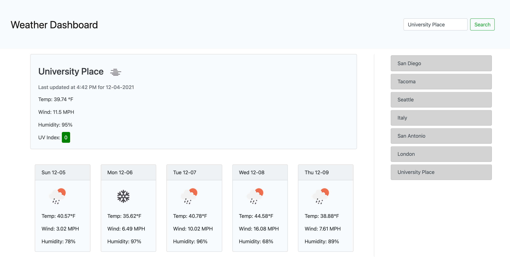

# Weather Dashboard ⛅

Type any city in the world into the search bar and see the current weather conditions for that specified city, including the temperature in degrees Farenheit, wind speed, humidity, and UV index. You will also see a five day forecast with each day containing information on temperature, wind speed, and humidity. Each search is saved to the search history list running down the right side of the page for future reference.

https://kelseybrianne.github.io/weather-dashboard/ 